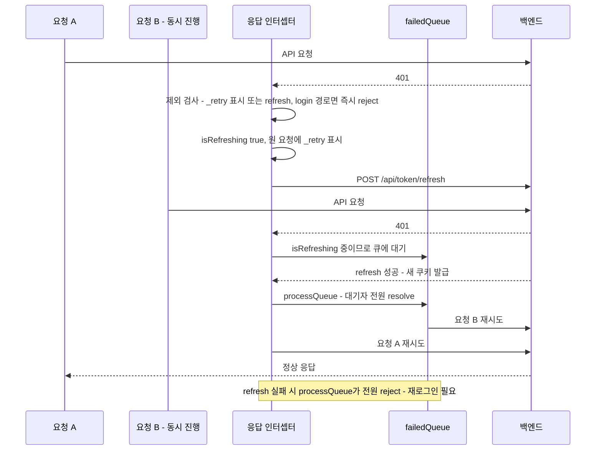
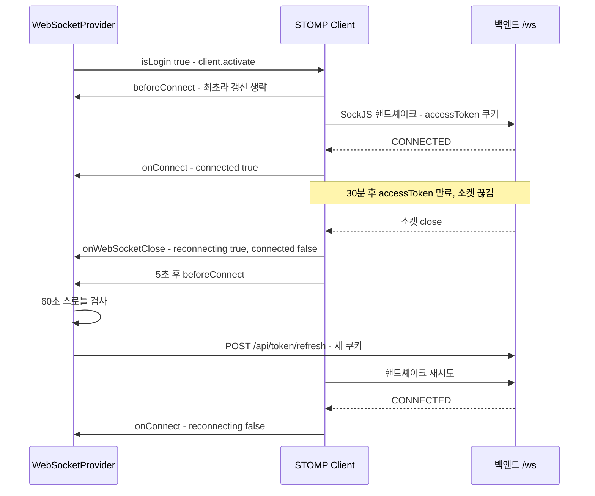

# Auth와 WebSocket — 토큰 갱신·재연결·채팅 구독 설계

이 저장소에서 가장 공들여 설계된 부분이다. HTTP의 401 기반 토큰 갱신과, 401이 오지 않는 WebSocket을 위한 선제 갱신이 짝을 이룬다. 서버 측 상대 동작은 [백엔드 04-request-flow.md](../../highteenday-backend/docs/04-request-flow.md)의 "WebSocket(STOMP) 연결의 여행" 섹션과 맞물려 있다.

## 이 문서가 답하는 질문

- accessToken이 만료되면 진행 중이던 여러 요청은 어떻게 되는가?
- 왜 WebSocket은 연결 **전에** 토큰을 갱신하는가? 401 인터셉터로는 왜 안 되는가?
- 재연결·연결 끊김은 어떤 콜백으로 감지하고 상태를 맞추는가?
- 채팅 구독은 어떤 구조이고, 재전송 중복과 안읽음 수는 어떻게 처리하는가?

## 3줄 요약

- HTTP: `utils/setupAxios.js`의 응답 인터셉터가 401을 받으면 refresh를 한 번만 수행하고, 그동안 도착한 401들은 `failedQueue`에 쌓았다가 일괄 재시도한다.
- WebSocket: 핸드셰이크 실패는 401이 아니라 "조용한 실패"라 인터셉터가 못 본다 — 그래서 `WebSocketContext.jsx`의 `beforeConnect`가 재연결 직전에 60초 스로틀로 선제 갱신한다.
- 채팅: ChatContext가 모든 방을 글로벌 구독해 목록·안읽음을 실시간 갱신하고(SYSTEM 제외), 전송은 `clientMsgId`로 서버 멱등성을, 수신은 `messageId` 중복 검사로 화면 멱등성을 지킨다.

## 1. HTTP 401 토큰 갱신 인터셉터 — utils/setupAxios.js

`setupAxiosInterceptors()`가 `src/index.js`에서 앱 시작 시 한 번 등록된다. 모듈 스코프의 `isRefreshing` 플래그와 `failedQueue` 배열이 핵심이다.

동작 규칙 (전부 `setupAxios.js · setupAxiosInterceptors` 실측):

1. **재시도는 딱 한 번** — 재시도 요청에 `_retry`를 찍어, 갱신 후에도 401이면 그대로 실패시킨다. 무한 루프 방지.
2. **제외 경로** — `/api/token/refresh`와 `/api/user/login` 자신의 401은 갱신 대상이 아니다 (refresh 실패가 다시 refresh를 부르는 재귀 차단, 로그인 실패는 자격증명 오류이므로).
3. **동시성** — 갱신이 진행 중일 때 도착한 401들은 `failedQueue`에 `{resolve, reject}`로 쌓이고, `processQueue`가 성공/실패를 일괄 통지한다. refresh 호출은 항상 1회다.
4. **토큰 저장 없음** — 갱신 결과는 HttpOnly 쿠키로만 온다. 프론트 코드는 토큰 문자열을 만지지 않는다.

## 2. WebSocket 인증 — 401이 오지 않는 세계

### 왜 선제 갱신인가

서버의 핸드셰이크 인증(`WebSocketAuthInterceptor`, [백엔드 04-request-flow.md](../../highteenday-backend/docs/04-request-flow.md) 참고)은 실패 시 명시적 401 대신 연결만 거부한다. `src/contexts/WebSocketContext.jsx`의 주석이 설계 배경을 그대로 기록하고 있다:

> "accessToken은 30분짜리인데 소켓은 그보다 오래 열려 있는다. 핸드셰이크(WebSocketAuthInterceptor)는 쿠키가 없으면 빈 200으로 조용히 거절하므로 axios의 401 기반 갱신 인터셉터가 이 실패를 영영 알지 못한다. 그래서 재연결 직전에 여기서 직접 토큰을 갱신한다."

### beforeConnect + 60초 스로틀

`WebSocketProvider`의 STOMP `Client` 설정 (`reconnectDelay: 5000`):

- `beforeConnect`: **재연결 상황일 때만** (`reconnectingRef`가 true) `POST /api/token/refresh`를 직접 호출한다. 최초 연결은 방금 로그인했거나 userInfo 확인 직후라 생략한다.
- 스로틀: 파일 상수 `TOKEN_REFRESH_INTERVAL_MS = 60_000`. 주석 그대로 — "토큰 갱신을 재시도마다(5초) 하면 refresh 토큰 회전이 과하게 돈다. 실패가 이어지는 동안엔 이 간격으로만 갱신한다." 즉 5초 간격 재시도 자체는 계속되지만 갱신 호출은 60초에 1회로 제한된다.
- refresh마저 실패하면 (refresh 토큰 만료) catch로 삼키고 재시도만 계속된다 — 재로그인 전까지 연결은 복구되지 않는다.

### 연결 상태 내리기 — onWebSocketClose가 진실

역시 파일 내 주석이 근거다: `onDisconnect`는 서버가 DISCONNECT 프레임을 정상 처리했을 때만 불리므로, 소켓이 끊기거나 핸드셰이크가 거절되는 경우를 잡으려면 소켓 레벨 콜백이 필요하다. 그래서 `onWebSocketClose`/`onWebSocketError`가 `reconnectingRef`를 true로 올리고 `connected`를 내린다 — "연결됐다고 착각한 채 전송이 사라지는" 상황을 막기 위한 것. `onStompError`도 규약상 서버가 연결을 닫으므로 `connected`를 내린다.

`subscribe`/`publish`는 `useCallback`으로, provider `value`는 `useMemo`로 참조가 고정된다 — 주석 명시대로, 이 값을 effect 의존성에 넣는 화면들이 불필요하게 재구독하지 않게 하기 위해서다. `publish`는 미연결이면 조용히 버리는 대신 `false`를 반환해 호출부가 사용자에게 알릴 수 있게 한다 (`Chat/ChatRoom.jsx`의 전송 실패 안내가 이를 소비).

## 3. ChatContext의 구독 구조 — src/contexts/ChatContext.jsx

### 이중 구독 구조

같은 토픽 `/topic/chat/room/{roomId}`을 목적이 다른 두 층이 구독한다.

| 층 | 구독 주체 | 목적 | 보관소 |
|---|---|---|---|
| 글로벌 | `ChatProvider`의 effect — 목록의 **모든** 방 | 방 목록의 lastMessage·정렬·안읽음 수 실시간 갱신 | `globalSubsRef` |
| 방 화면 | `ChatRoom.jsx`가 `subscribeChatRoom(roomId, onMessage)` 호출 — 현재 방 하나 | 메시지 타임라인 append, 읽음 위치 갱신 | `subscriptionsRef` |

- 글로벌 effect는 `connected && chatRooms.length > 0`일 때 방 목록과 구독 목록을 대조해 빠진 방을 구독하고 사라진 방을 해지한다. 단, effect 의존성이 `chatRooms.length`라서 **개수가 같은 목록 교체는 감지하지 못한다** — [FKI-08](KNOWN-ISSUES.md#fki-08-chatcontext--재구독-누락-가능성--provider-value-미메모이제이션).
- `activeRoomRef`로 "지금 보고 있는 방"을 기억해, 그 방의 수신은 안읽음으로 세지 않는다.
- **SYSTEM 메시지는 안읽음에서 제외**한다 — 주석: "서버 집계와 기준을 맞춘 것". `unreadCount` 증가와 `totalUnreadCount` 증가 양쪽 모두에서 `msg.type !== "SYSTEM"` 조건이 걸려 있다.

### clientMsgId 멱등성 — 전송과 수신의 이중 방어

- 전송: `sendMessage`가 매 전송에 `clientMsgId`(가능하면 `crypto.randomUUID`, 폴백은 타임스탬프+난수 — `newClientMsgId`)를 실어 보낸다. 주석: "재전송 멱등성 키. 같은 값으로 두 번 올라가면 서버가 한 번만 저장한다." 즉 재전송 중복 제거의 1차 책임은 서버다.
- 수신: 방 화면(`Chat/ChatRoom.jsx`의 구독 콜백)은 `prev.some(m => m.messageId === msg.messageId)`로 **서버가 부여한 messageId** 기준 중복을 버린다 — 재구독 직후 같은 메시지가 두 번 브로드캐스트로 들어와도 화면에 한 번만 그려진다.

### 읽음 처리

- `markAsRead(roomId, lastMsgId)`가 `PATCH /api/chat/rooms/{roomId}/read?lastMsgId=...`로 "어디까지 읽었는지"를 남기고, 로컬 `unreadCount`를 0으로 내리며 `totalUnreadCount`에서 차감한다.
- `ChatRoom.jsx · advanceReadPosition`은 서버가 /read 이벤트로 방송하지 않는 "발신자 자신의 읽음 전진"을 클라이언트에서 재현한다 — 파일 주석에 서버 동작 근거가 상세히 기록되어 있다. 메시지별 미읽음 인원 수는 `messagesWithMeta`가 "읽음 위치가 메시지 ID보다 작은 참여자 수"로 서버와 같은 규칙으로 계산한다.

## 코드 좌표

| 개념 | 위치 |
|---|---|
| 401 인터셉터·failedQueue | `src/utils/setupAxios.js · setupAxiosInterceptors / processQueue` |
| 인터셉터 등록·baseURL | `src/index.js` |
| 선제 토큰 갱신·스로틀 | `src/contexts/WebSocketContext.jsx · beforeConnect / TOKEN_REFRESH_INTERVAL_MS` |
| 연결 상태 콜백 | `src/contexts/WebSocketContext.jsx · onWebSocketClose / onWebSocketError / onStompError` |
| 구독·발행 프리미티브 | `src/contexts/WebSocketContext.jsx · subscribe / publish` |
| 글로벌 방 구독·안읽음 집계 | `src/contexts/ChatContext.jsx · ChatProvider의 글로벌 구독 effect` |
| 전송 멱등성 키 | `src/contexts/ChatContext.jsx · newClientMsgId / sendMessage` |
| 수신 중복 제거·읽음 위치 | `src/components/Chat/ChatRoom.jsx · 구독 effect / advanceReadPosition / messagesWithMeta` |
| 서버 측 상대 동작 | 백엔드 `security/WebSocketAuthInterceptor` 외 — [백엔드 04-request-flow.md](../../highteenday-backend/docs/04-request-flow.md) |

## 알려진 문제·미확인 사항

- [FKI-08](KNOWN-ISSUES.md#fki-08-chatcontext--재구독-누락-가능성--provider-value-미메모이제이션) 구독 effect 의존성이 `chatRooms.length`라 방 구성만 바뀌면 재구독 누락 + provider value 미메모이제이션
- `[미확인: 핸드셰이크 거부 시 실제 HTTP 응답 형태 — 프론트 주석은 "빈 200"이라 기록하나 브라우저에서 실측하지 않음. 백엔드 04-request-flow.md도 같은 항목을 미확인으로 관리 중]`
- `[미확인: 60초 스로틀 안에서 refresh 토큰 만료가 임박한 경계 케이스의 동작 — 코드 경로상 재로그인 전까지 재시도만 반복되는 것으로 읽히나 장시간 실측하지 않음]`

마지막 검증일: 2026-07-30
